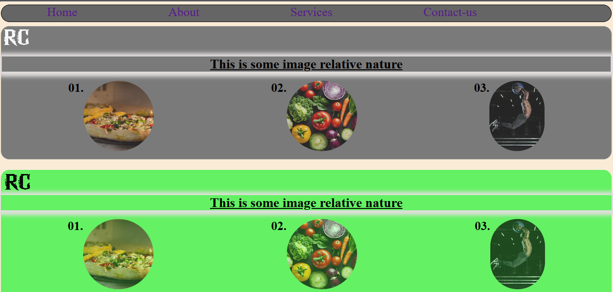

# 🌐 Portfolio Website

This is my first personal portfolio website project created to practice basic web development skills.

---

## 📌 Project Purpose

The main goal of this project is to understand:

- HTML structure
- CSS styling
- Layout design
- Navigation bar creation
- Image section handling

This project is part of my web development learning journey.

---

## 🛠 Technologies Used

- HTML5
- CSS3
- JavaScript (planned for future enhancement)

---

## ✨ Features

- Simple and clean layout
- Navigation bar (Home, About, Services, Contact)
- Image section with circular images
- Basic responsive structure
- Organized folder structure

---

## 📂 Folder Structure

```
01-portfolio/
│── index.html
│── style.css
│── portfolio.png
│── README.md
```

---

## 📸 Screenshot



---

## 🚀 How to Run

1. Download or clone this repository.
2. Open the `index.html` file in your browser.
3. Explore the portfolio layout.

---

## 🔮 Future Improvements

- Add JavaScript functionality
- Improve responsiveness
- Add animations
- Improve UI design

---

## 📌 Status

🟢 In Progress (Learning Project)
