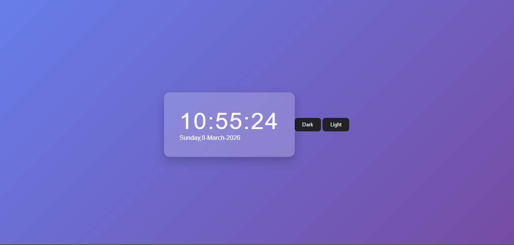

# JavaScript Digital Clock ⏰

A simple digital clock built using HTML, CSS, and JavaScript.
It displays the current time and date and includes a dark and light mode feature.

---

## About

This project was created to practice JavaScript concepts such as the Date object, DOM manipulation, and event handling.

---

## Technologies Used

- HTML
- CSS
- JavaScript

---

## Features

- Display current time
- Display current date
- Dark mode
- Light mode

---

## Screenshot

## Screenshot

---

javascript-digital-clock
│
├── clock.html
│
├── css
│   └── clock.css
│
├── js
│   └── clock.js
│
├── screenshots
│   └── digital-clock.png
│
└── README.md

---

##▶️ How to Run

1.Download or clone repository
2.Open the project folder
3.Open clock.html in your browser

---

##🎯 Purpose

- This project is part of my web development learning journey, where I practice building small projects using JavaScript.
