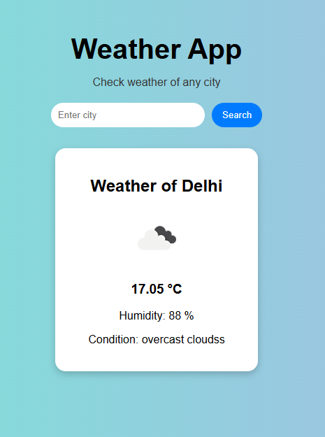

# 🌦️ Weather App

A simple Weather App built using Node.js, Express, and Pug.

## 🚀 Features
- Search weather by city name
- Real-time weather data using OpenWeather API
- Clean and responsive UI
- Displays temperature, humidity, and condition

## 🛠️ Tech Stack
- Node.js
- Express.js
- Pug (Template Engine)
- CSS

## 📸 Screenshot

## ▶️ How to Run
1. Clone the repository
2. Run `npm install`
3. Add your API key in app.js
4. Run `node app.js`
5. Open http://localhost:3000

## 📌 API Used
OpenWeather API

## 📁 Folder Structure

Weather-App/
 ├── app.js
 ├── package.json
 ├── views/
 │    └── index.pug
 ├── public/
 │    └── style.css
 └── README.md
