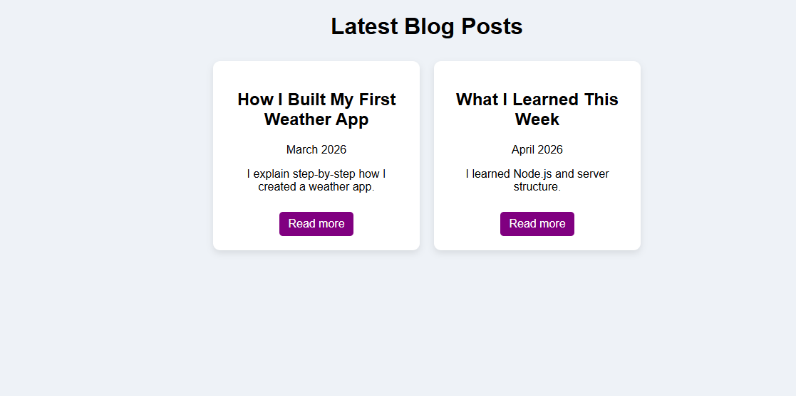

# 🌐 Blog Website

A simple and clean Blog Website built using Node.js, Express, and Pug.  
Users can view blog posts and click **Read More** to see full detailed content.

---

## 🚀 Features

- 📌 Blog cards layout (Home page)
- 📖 "Read More" functionality (separate full page)
- 🔄 Dynamic routing using Express
- 🧠 Step-by-step explanation posts
- 🎨 Clean UI design

---

## 🛠️ Tech Stack

- Node.js
- Express.js
- Pug (Template Engine)
- CSS

---

## 📂 Folder Structure

```
Blog-Website/
│
├── app.js
├── package.json
│
├── views/
│   ├── index.pug
│   └── post.pug
│
├── public/
│   └── style.css
│
└── README.md
```

---

## ▶️ How to Run

1. Clone this repository  
2. Install dependencies  
   ```
   npm install
   ```
3. Run the server  
   ```
   node app.js
   ```
4. Open in browser  
   ```
   http://localhost:3000
   ```

---

## 📸 Screenshot



---

## 🎯 Purpose

- Practice backend development using Node.js & Express
- Understand routing and dynamic pages
- Improve UI design and layout skills
- Learn real-world project structure

---

## 📚 Example Blog Content

Each blog contains:
- Title
- Date
- Short description
- Full explanation (step-by-step)

Example:
```
Step 1: Install Node.js  
Step 2: Setup Express server  
Step 3: Create routes  
Step 4: Design UI using Pug  
```

---

## ✍️ Author

**Rohit Chaudhary**

---

## ⭐ Future Improvements

- Add database (MongoDB)
- Create post feature (Admin panel)
- Add images in blogs
- Add user authentication

---

⭐ If you like this project, give it a star!
