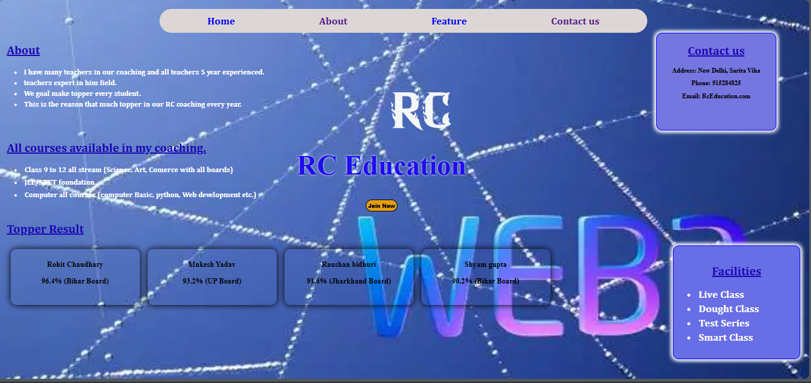

# 🎓 EduEnroll Pro – Coaching Admission System

A full-stack coaching website where students can explore courses, view toppers, and enroll through an admission form. All form data is stored in MongoDB.

---

## 🚀 Features

- Home page with coaching details  
- "Join Now" button → opens admission form  
- Student admission form  
- Data stored in MongoDB  
- Topper results section  
- Courses information  
- Facilities (Live Classes, Test Series, Doubt Classes)  
- Modern UI with background overlay  

---

## 🛠️ Tech Stack

- Node.js  
- Express.js  
- MongoDB  
- Pug  
- HTML, CSS  

---

## 📂 Project Structure

```
EduEnroll-Pro/
│── app.js
│── package.json
│── public/
│   ├── style.css
│   ├── images/
│
│── views/
│   ├── index.pug
│   ├── form.pug
│
│── README.md
```

---

## ⚙️ Setup Instructions

1. Clone repository
```
git clone https://github.com/heyrohitdev/edu-enroll-pro.git
cd edu-enroll-pro
```

2. Install dependencies
```
npm install
```

3. Start MongoDB (local)

4. Run project
```
node app.js
```

5. Open in browser
```
http://localhost:3000
```

---

## 📸 Screenshots

- Home Page  
- Admission Form  



---

## 🎯 Purpose

This project helps students easily choose and enroll in coaching institutes. It builds trust using topper results and detailed course information.

---

## 🚀 Future Improvements

- Login & Signup system  
- Admin dashboard  
- Deploy online  
- Responsive design  

---

## 👨‍💻 Author

Rohit Chaudhary
