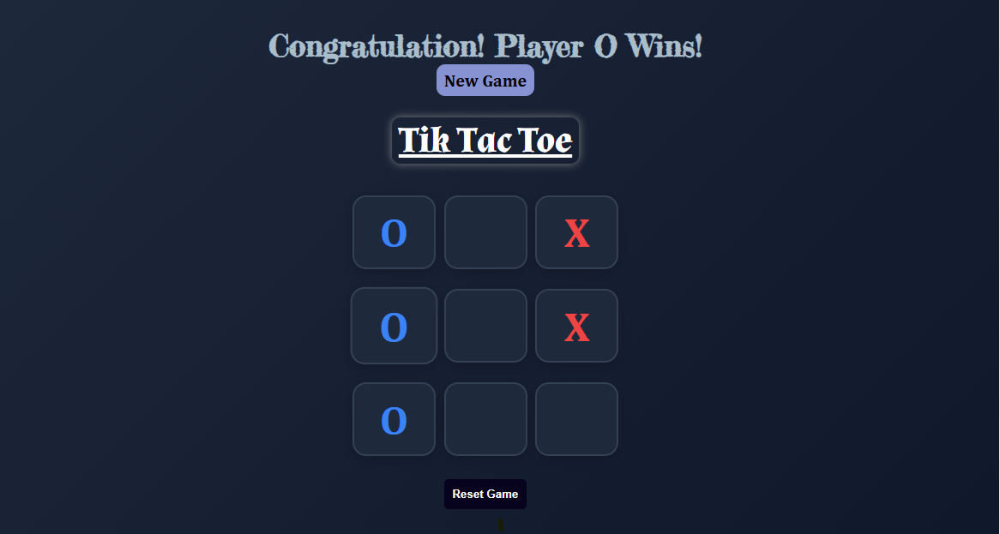

# Tic Tac Toe Game

A simple and interactive Tic Tac Toe game built using HTML, CSS, and JavaScript. This project was created to practice JavaScript fundamentals, DOM manipulation, event handling, and game logic development.

---

## About

Tic Tac Toe is a classic two-player game where players take turns placing **X** and **O** on a 3×3 grid.

The first player to align three identical symbols horizontally, vertically, or diagonally wins the game. If all cells are filled without a winner, the game ends in a draw.

---

## ✨ Features

* Two-player gameplay
* Winner detection system
* Reset Game functionality
* New Game button
* Interactive user interface
* Built with pure JavaScript
* Responsive layout

---

## 🛠️ Technologies Used

* HTML5
* CSS3
* JavaScript (ES6)

---

## Project Screenshot


---
## 🚀 Live Demo

https://heyrohitdev.github.io/web-development-project/12-tic-tac-toe-game/

---

## How to Run the Project

1. Clone the repository

```bash
git clone https://github.com/your-username/tic-tac-toe-javascript.git
```

2. Open the project folder

3. Run `index.html` in your browser

---

## Learning Outcomes

Through this project, I practiced:

* DOM Manipulation
* Event Handling
* JavaScript Functions
* Conditional Logic
* Game Development Basics
* Problem Solving Skills

---

## Future Improvements

* Score Board
* Sound Effects
* Dark Mode
* Mobile UI Enhancements
* Single Player Mode (AI)
* Winning Line Animation

---

## Project Structure

```text
tic-tac-toe-javascript/
│
├── index.html
├── style.css
├── script.js
│
├── screenshots/
│   └── project-preview.png
│
└── README.md
```

---

## Author

**Rohit Chaudhary**

Learning Web Development and building projects using HTML, CSS, and JavaScript.
