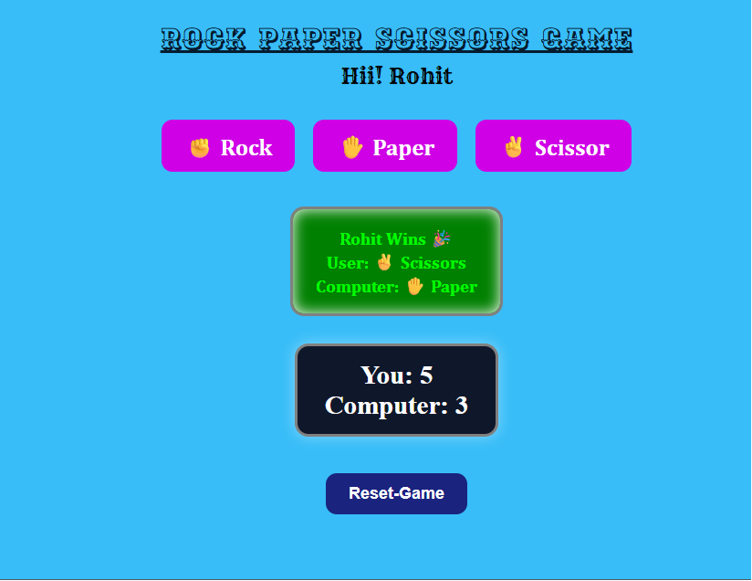

# ✊ Rock Paper Scissors Game

A simple and interactive Rock Paper Scissors game built using HTML, CSS, and JavaScript. This project focuses on JavaScript logic, DOM manipulation, event handling, and score tracking.

---

## 📖 About

Rock Paper Scissors is a classic game played between a user and the computer.

The player can choose one of three options:

* ✊ Rock
* ✋ Paper
* ✌️ Scissors

The computer randomly selects its choice, and the winner is determined according to the game rules. The score is updated after every round.

---

## ✨ Features

* Choose between Rock, Paper, and Scissors
* Random computer choice generation
* Winner announcement after every round
* Live score tracking
* Reset Game functionality
* Interactive and responsive UI
* Hover and click button effects

---

## 📸 Screenshot

---

## 🚀 Live Demo

([Play Game](https://heyrohitdev.github.io/web-development-project/13-RPS-Game/))

---

## 🛠️ Technologies Used

* HTML5
* CSS3
* JavaScript (ES6)

---

## 🎯 Purpose

This project was created to:

* Practice JavaScript fundamentals
* Improve DOM manipulation skills
* Learn event handling
* Build logic-based projects
* Strengthen frontend development skills
* Create projects for a developer portfolio

---

## 👨‍💻 Author

Rohit Chaudhary
