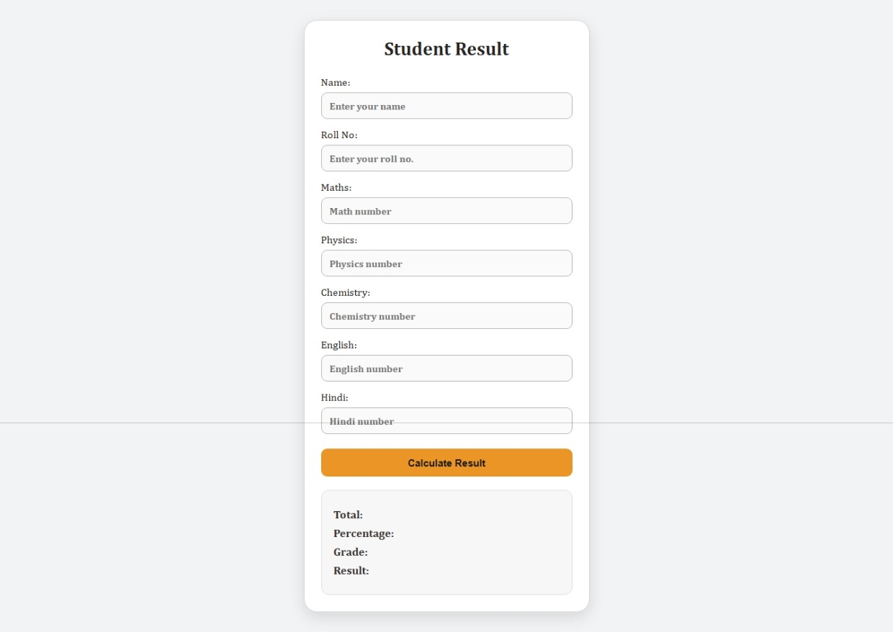

# 🎓 Student Result Manager

A simple and user-friendly web application built with **HTML, CSS and JavaScript** to calculate and display a student's **total marks, percentage, grade and pass/fail result** based on entered marks.

---

## ✨ Features

* 🧑‍🎓 Student Detail Form
* 📝 Enter marks for different subjects
* 🧮 Calculate total marks and percentage
* 🏆 Automatically calculate grade
* ✅❌ Display Pass/Fail result
* 📱 Simple and clean user interface
* ⚡ Instant result using JavaScript

---

## 📸 Screenshot

---

## 🌐 Live Demo

🔗 **[View Live Demo](https://heyrohitdev.github.io/web-development-project/14-Student-Result-Manager/)**

---

## 🛠️ Technology Used

* 🌐 HTML
* 🎨 CSS
* ⚡ JavaScript

---

## 🎯 Purpose

* 💻 To strengthen JavaScript concepts
* 🧠 To practice DOM manipulation and JavaScript logic
* 🚀 To build a practical frontend web project
* 📂 To add a real-world project to my web development portfolio

---

## 👨‍💻 Author

**Rohit Chaudhary**

🎯 Aspiring Full-Stack Web Developer
